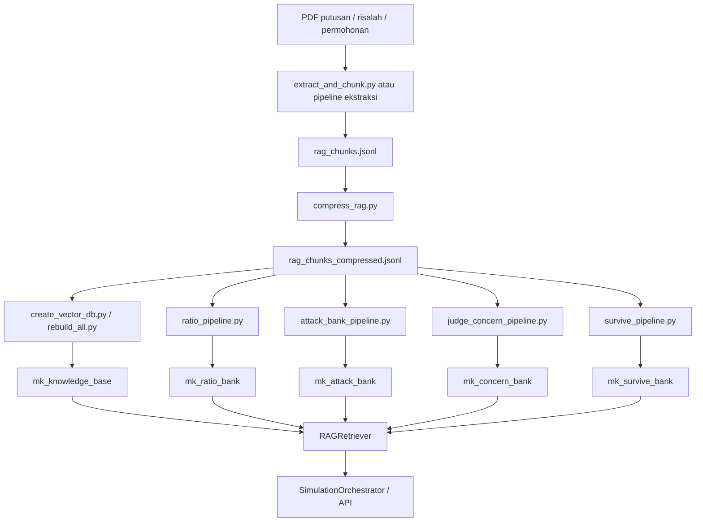

# Data dan RAG Pipeline

Dokumen ini menjelaskan sumber data, artefact, pipeline RAG, dan area fine-tuning di Simu JR.

## Sumber Data

| Data | Lokasi root | Kegunaan |
|---|---|---|
| Putusan PUU PDF | `E:\Simu JR\putusan_pdf` | Basis putusan dan ratio decidendi |
| Risalah PUU PDF | `E:\Simu JR\risalah_pdf` | Basis dialog sidang, pertanyaan hakim, respons pihak |
| Permohonan PDF | `E:\Simu JR\permohonan_pdf` | Korpus draft/permohonan untuk drafter |
| HTML putusan | `E:\Simu JR\source_link_puu` | Sumber ekstraksi link putusan |
| HTML risalah | `E:\Simu JR\source_link_risalah_puu` | Sumber ekstraksi link risalah |
| UUD 1945 PDF | `E:\Simu JR\UUD45_SatuNaskah.pdf` | Sumber pasal konstitusi |

## Script Root-Level

| Script | Fungsi |
|---|---|
| `extract_pdf_links.py` | Mengekstrak link PDF dari HTML sumber |
| `download_putusan_pdf.py` | Download putusan PUU |
| `download_risalah_pipeline.py` | Download risalah PUU |
| `download_permohonan.py` | Download permohonan |
| `verify_permohonan.py` | Verifikasi hasil download permohonan |
| `analyze_permohonan.py` | Analisis permohonan |
| `reorganize_permohonan.py` | Merapikan struktur file permohonan |

## RAG Artefact

| Artefact | Lokasi | Keterangan |
|---|---|---|
| Chunk mentah | `simulasi/rag/rag_chunks.jsonl` | Hasil ekstraksi dan chunking |
| Chunk kompresi | `simulasi/rag/rag_chunks_compressed.jsonl` | Dedup/clean untuk embedding |
| ChromaDB | `simulasi/rag/chroma_db` | Vector store utama dan intelligence bank |
| UUD JSON | `simulasi/rag/uud_1945.json` | Representasi pasal UUD |
| Prompt pipeline | `simulasi/rag/prompts/*.txt` | Prompt Agent 1-7 dan reviser |

## Collection ChromaDB

| Collection | Isi |
|---|---|
| `mk_knowledge_base` | Knowledge base utama dari chunk putusan/risalah |
| `mk_ratio_bank` | Ratio decidendi dan pola putusan |
| `mk_attack_bank` | Pola bantahan/serangan Pemerintah/DPR |
| `mk_concern_bank` | Pertanyaan dan concern hakim |
| `mk_survive_bank` | Formulasi Pemohon yang bertahan dalam sidang/putusan |

Nama collection dikontrol oleh `config.yaml` dan `.env`.

## Rebuild Pipeline

Masuk ke folder RAG:

```powershell
cd "E:\Simu JR\simulasi\rag"
```

Lihat statistik:

```powershell
python rebuild_all.py --stats
```

Full rebuild:

```powershell
python rebuild_all.py
```

Hanya rebuild main knowledge base:

```powershell
python rebuild_all.py --db-only
```

Hanya intelligence pipeline:

```powershell
python rebuild_all.py --pipelines
```

Hanya kompresi JSONL:

```powershell
python rebuild_all.py --compress
```

## Urutan Data Flow



## Permohonan Corpus

Korpus permohonan dikelola oleh `core/permohonan_corpus.py` dan endpoint:

- `GET /api/permohonan-corpus/status`
- `POST /api/permohonan-corpus/reindex`
- `POST /api/projects/{project_id}/permohonan-drafts/stream`

Status korpus mencakup:

- jumlah file total,
- file berhasil diekstrak,
- file gagal,
- file yang butuh OCR,
- jumlah pasangan revisi,
- ketersediaan artefact pendukung.

OCR data tersedia di `simulasi/ocr_tessdata`.

## Fine-tuning

Folder `simulasi/finetuning` berisi script dan dataset untuk eksperimen fine-tuning.

| File/folder | Fungsi |
|---|---|
| `config.py` | Konfigurasi fine-tuning |
| `extract_risalah_dialogs.py` | Ekstraksi dialog dari risalah |
| `format_chatml.py` | Format data ke ChatML |
| `convert_to_gemma4.py` | Konversi format Gemma |
| `quality_filter.py` | Filter kualitas dataset |
| `sort_by_length.py` | Sorting data berdasarkan panjang |
| `train.py`, `hf_train.py`, `unsloth_studio_train.py` | Training |
| `merge_and_export.py` | Merge/export model |
| `data/*.jsonl` | Dataset train/val/test |

Dataset di `finetuning/data` berukuran besar. Jangan ubah/hapus tanpa backup.

## Verifikasi Setelah Rebuild

1. Cek stats:

```powershell
python "E:\Simu JR\simulasi\rag\rebuild_all.py" --stats
```

2. Jalankan backend:

```powershell
cd "E:\Simu JR\simulasi"
python server.py
```

3. Cek health:

```powershell
Invoke-RestMethod http://localhost:8080/api/health
```

4. Jalankan simulasi kecil dari UI atau CLI.

## Masalah Umum

| Gejala | Kemungkinan | Tindakan |
|---|---|---|
| `/api/health` menunjukkan RAG error | Path ChromaDB salah atau DB belum ada | Cek `CHROMA_DB_PATH`, jalankan `rebuild_all.py --stats` |
| Intelligence bank kosong | Pipeline Agent 2-5 belum dijalankan | Jalankan `rebuild_all.py --pipelines` |
| Embedding lambat/gagal | Model embedding memakai device yang tidak tersedia | Cek `rebuild_all.py`, bagian `SentenceTransformerEmbeddingFunction` |
| Draft tidak memakai konteks relevan | Retrieval kurang cocok | Cek `rag.n_results`, `score_threshold`, dan query yang dikirim |
| JSONL terlalu besar | Data belum dikompresi | Jalankan `rebuild_all.py --compress` |

