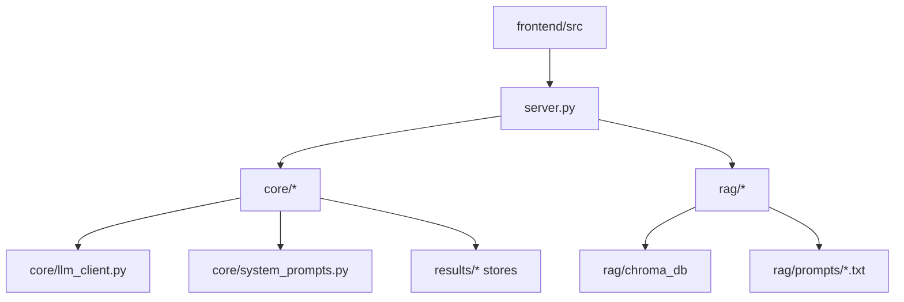

# Development Map

Dokumen ini memetakan area kode agar maintainer cepat tahu harus mengubah file mana.

## Backend Entry Points

| File | Peran |
|---|---|
| `server.py` | FastAPI app, endpoint API, SSE streaming, static serving |
| `main.py` | CLI runner untuk simulasi dan self-correcting loop |
| `MULAI_SIMULASI.bat` | Launcher Windows untuk user non-teknis |
| `Dockerfile` | Build container backend |

## Core Modules

| File | Peran |
|---|---|
| `core/llm_client.py` | Konfigurasi dan client LLM |
| `core/agents.py` | BaseAgent dan role agent sidang |
| `core/system_prompts.py` | Prompt utama agent |
| `core/orchestrator.py` | Alur sidang, turn management, RAG context, scoring |
| `core/self_correcting_loop.py` | Loop perbaikan draft otomatis |
| `core/draft_reviser.py` | Revisi draft |
| `core/permohonan_corpus.py` | Indexing dan handoff korpus permohonan |
| `core/permohonan_drafts.py` | Simpan/list/export draft permohonan |
| `core/project_store.py` | Storage project, file, research, audit |
| `core/simulation_store.py` | Storage simulasi |
| `core/pdf_generator.py` | Export PDF |
| `core/templates.py` | Template dokumen/putusan |
| `core/utils.py` | Helper ekstraksi file dan utilitas |

## RAG Modules

| File | Peran |
|---|---|
| `rag/retriever.py` | Query knowledge base dan intelligence banks |
| `rag/rebuild_all.py` | Rebuild terpadu |
| `rag/extract_and_chunk.py` | Ekstraksi dan chunking |
| `rag/create_vector_db.py` | Membuat vector DB |
| `rag/compress_rag.py` | Dedup dan kompresi JSONL |
| `rag/pipeline_utils.py` | Helper pipeline |
| `rag/ratio_pipeline.py` | Ratio bank |
| `rag/attack_bank_pipeline.py` | Attack bank |
| `rag/judge_concern_pipeline.py` | Concern bank |
| `rag/survive_pipeline.py` | Survive bank |
| `rag/pasal_api.py` | Integrasi Pasal API |

## Frontend Modules

| File/folder | Peran |
|---|---|
| `frontend/src/App.tsx` | Routing aplikasi |
| `frontend/src/types.ts` | Tipe data API/UI |
| `frontend/src/hooks/useApi.ts` | Hook API dan SSE |
| `frontend/src/context/ProjectContext.tsx` | State project aktif |
| `frontend/src/context/SimulationContext.tsx` | State simulasi |
| `frontend/src/pages/` | Halaman dashboard, project, simulasi, settings, draft |
| `frontend/src/components/layout/` | Layout utama, sidebar, topbar, status |
| `frontend/src/utils/sseParser.ts` | Parser Server-Sent Events |

## Where to Change What

| Ingin mengubah | File utama | File pendamping |
|---|---|---|
| Endpoint baru | `server.py` | `frontend/src/hooks/useApi.ts`, `frontend/src/types.ts`, `docs/API_REFERENCE.md` |
| Role agent baru | `core/agents.py` | `core/system_prompts.py`, `core/orchestrator.py`, tests |
| Fase sidang | `core/orchestrator.py` | tests, frontend progress/status |
| Scoring | `core/orchestrator.py`, `config.yaml` | tests, UI score display |
| Provider LLM | `core/llm_client.py`, `.env.example` | settings UI, health endpoint |
| RAG retrieval | `rag/retriever.py` | `config.yaml`, `docs/DATA_PIPELINES.md` |
| Intelligence pipeline | `rag/*_pipeline.py` | `rag/prompts/*.txt`, `rebuild_all.py` |
| Project storage | `core/project_store.py` | project API, frontend project hooks |
| Simulation history | `core/simulation_store.py` | saved simulation API, frontend |
| Draft permohonan | `core/permohonan_drafts.py`, `core/permohonan_corpus.py` | draft tab, API docs |
| UI page | `frontend/src/pages/*` | hooks/types/context |

## Test Map

| Test | Fokus |
|---|---|
| `tests/test_agents.py` | Agent, memory, thinking filter, validator, import compatibility |
| `tests/test_hearing_profiles.py` | Mode/profil persidangan |
| `tests/test_permohonan_corpus.py` | Korpus permohonan |
| `tests/test_permohonan_drafts.py` | Draft permohonan |

## Dependency Direction

Prinsip maintenance: jaga agar UI hanya bicara ke API, API mengoordinasikan use case, core menjalankan domain logic, dan RAG/storage tetap berada di modul khusus.

