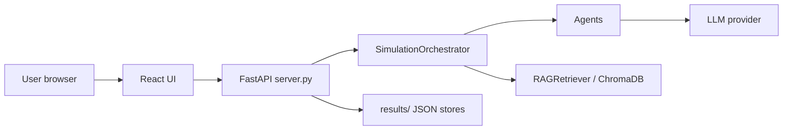

# Dokumentasi Simu JR

Folder ini berisi dokumentasi teknis untuk aplikasi utama di `E:\Simu JR\simulasi`.

## Peta Dokumen

| Dokumen | Kapan dibaca |
|---|---|
| `ARCHITECTURE.md` | Memahami desain sistem, modul, agent, dan flow besar |
| `API_REFERENCE.md` | Menambah/memakai endpoint backend |
| `MAINTENANCE.md` | Menjalankan, debug, test, backup, dan checklist perubahan |
| `DATA_PIPELINES.md` | Mengelola dataset, RAG, ChromaDB, intelligence banks, dan finetuning |
| `INSTALLER_AND_UPDATES.md` | Membuat installer, app update, dan RAG data pack bulanan |
| `FINETUNING-PLAN.md` | Rencana fine-tuning model |
| `PLAN-ui-fixes.md` | Catatan rencana perbaikan UI |

## Ringkasan Sistem

Simu JR terdiri dari:

- Backend FastAPI di `server.py`.
- CLI runner di `main.py`.
- Engine agent di `core/`.
- RAG dan pipeline dataset di `rag/`.
- React/Vite frontend di `frontend/`.
- Output runtime di `results/`.

Alur request utama:



## Quick Commands

```powershell
cd "E:\Simu JR\simulasi"
python server.py
python -m pytest tests -v
python rag/rebuild_all.py --stats
```

```powershell
cd "E:\Simu JR\simulasi\frontend"
npm run dev
npm run build
npm run lint
```
